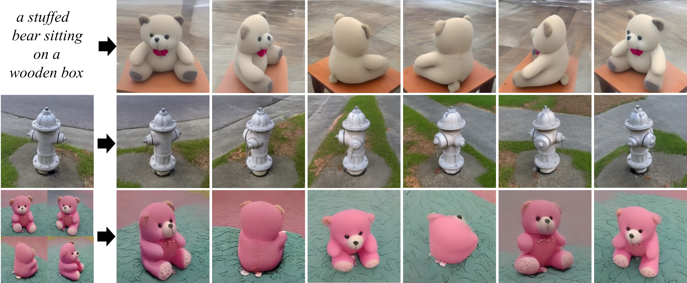

# ViewDiff: 3D-Consistent Image Generation with Text-to-Image Models
ViewDiff generates high-quality, multi-view consistent images of a real-world 3D object in authentic surroundings.

This is the official repository that contains source code for the CVPR 2024 paper [ViewDiff](https://lukashoel.github.io/ViewDiff/).

[[arXiv](https://arxiv.org/abs/2403.01807)] [[Project Page](https://lukashoel.github.io/ViewDiff/)] [[Video](https://youtu.be/SdjoCqHzMMk)]



If you find ViewDiff useful for your work please cite:
```
@inproceedings{hoellein2024viewdiff,
    title={ViewDiff: 3D-Consistent Image Generation with Text-To-Image Models},
    author={H{\"o}llein, Lukas and Bo\v{z}i\v{c}, Alja\v{z} and M{\"u}ller, Norman and Novotny, David and Tseng, Hung-Yu and Richardt, Christian and Zollh{\"o}fer, Michael and Nie{\ss}ner, Matthias},
    booktitle={Proceedings of the IEEE/CVF Conference on Computer Vision and Pattern Recognition},
    year={2024}
}
```

## Installation

Create a conda environment with all required dependencies:

```
conda create -n viewdiff python=3.10
conda activate viewdiff
pip install -r requirements.txt
```

Then install Pytorch3D by following the official instructions. For example, to install Pytorch3D on Linux (tested with Pytorch3D 0.7.4):

```
conda install -c fvcore -c iopath -c conda-forge fvcore iopath
pip install "git+https://github.com/facebookresearch/pytorch3d.git@stable"
```

Then manually update triton to the required version:

```
pip install --upgrade triton==2.1.0
```

## Data Preparation

- Download CO3D categories that you would like to train on. Follow the official instructions here: https://github.com/facebookresearch/co3d. You should end up with a directory structure like this:

```
<co3d_root>
<co3d_root>/teddybear
<co3d_root>/hydrant
<co3d_root>/donut
<co3d_root>/apple
...
```

- Generate BLIP2 text captions from the images for each category:

```
export CO3DV2_DATASET_ROOT=<path/to/co3d>
python -m viewdiff.data.co3d.generate_blip2_captions --dataset-config.co3d_root <path/to/co3d> --output_file <path/to/co3d>/co3d_blip2_captions.json
```

- Generate the prior preservation (aka Dreambooth) dataset for each category:

```
export CO3DV2_DATASET_ROOT=<path/to/co3d>
python -m viewdiff.data.co3d.generate_co3d_dreambooth_data --prompt_file <path/to/co3d>/co3d_blip2_captions.json --output_path <path/to/co3d>/dreambooth_prior_preservation_dataset
```

- Recenter the poses of each object, such that the object lies within the unit cube:

```
export CO3DV2_DATASET_ROOT=<path/to/co3d>
python -m viewdiff.data.co3d.save_recentered_sequences --dataset-config.co3d_root <path/to/co3d>
```

## Training

Execute the following script (requires 2x A100 80GB GPUs):

```
./viewdiff/scripts/train.sh <path/to/co3d> "stabilityai/stable-diffusion-2-1-base" outputs/train <category=teddybear>
```

If you only have a smaller GPU available and want to sanity check that everything is working, you can execute this script (e.g. on a RTX 3090 GPU):

```
./viewdiff/scripts/train_small.sh <path/to/co3d> "stabilityai/stable-diffusion-2-1-base" outputs/train <category=teddybear>
```

In our experiments, we train the model for 60K iterations.

## Evaluation

First, export a trained model to a runnable checkpoint:

```
python -m viewdiff.convert_checkpoint_to_model --checkpoint-path <path/to/checkpoint-XXXXX>
```

### Create 360 Degree Images In A Single Batch

Execute the following script:

```
./viewdiff/scripts/test/test_spherical_360_256x256.sh <path/to/co3d> <path/to/saved_model_from_checkpoint-XXXXX> outputs/single-batch-uncond-generation <num_images=10> <category=teddybear> <num_steps=50>
```

This creates ```num_images``` images of a single object in a single forward pass of the model (first row in the teaser image).
In total ```num_steps``` objects will be created.

### Create Smooth Rendering Around An Object (Elevation=60 Degrees)

Execute the following script:

```
./viewdiff/scripts/test/test_sliding_window_smooth_alternating_theta_60_360_256x256.sh <path/to/co3d> <path/to/saved_model_from_checkpoint-XXXXX> outputs/smooth-autoregressive-theta-60 <category=teddybear>
```

This creates a video rendering of an object in a spherical trajectory at 60 degrees elevation.

### Create Smooth Rendering Around An Object (Elevation=30 Degrees)

Execute the following script:

```
./viewdiff/scripts/test/test_sliding_window_smooth_alternating_theta_30_360_256x256.sh <path/to/co3d> <path/to/saved_model_from_checkpoint-XXXXX> outputs/smooth-autoregressive-theta-30 <category=teddybear>
```

This creates a video rendering of an object in a spherical trajectory at 30 degrees elevation.

### Condition Generation On Single Input Image

Execute the following script:

```
./viewdiff/scripts/test/eval_single_image_input.sh <path/to/co3d> <path/to/saved_model_from_checkpoint-XXXXX> outputs/single-image-eval <category=teddybear>
```

This renders novel views for an object of the test set given a single image input.
We also save the quantitative metrics PSNR, SSIM, LPIPS in the output directory.

### Optimize a NeRF

We provide an easy way to train a NeRF from our generated images.
When creating a smooth rendering, we save a ```transforms.json``` file in the standard NeRF convention, that can be used to optimize a NeRF for the generated object.
It can be used with standard NeRF frameworks like [Instant-NGP](https://github.com/NVlabs/instant-ngp) or [NeRFStudio](https://github.com/nerfstudio-project/nerfstudio).

## LICENSE

The majority of this repository is licensed under CC-BY-NC, however portions of the project are available under separate license terms:
- diffusers is licensed under the Apache 2.0 license. We use the repository to extend the default U-Net architecture, by adapting the model definition found in the original library.

- Fastplane (aka [Lightplane](https://lightplane.github.io/)) module for memory-efficient volumetric rendering is licensed under the BSD License. Please consider citing the original paper if you find the module useful:
```
@article{cao2024lightplane,
    author = {Ang Cao and Justin Johnson and Andrea Vedaldi and David Novotny},
    title = {Lightplane: Highly-Scalable Components for Neural 3D Fields},
    journal = {arXiv},
    year = {2024},
}
```
